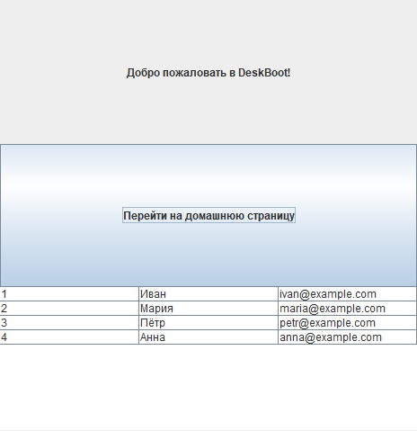

# 🖼️ DeskBoot — фреймворк для Swing UI на Java

**DeskBoot** — это лёгкий фреймворк для создания desktop-приложений на Java с использованием Swing.  
Он упрощает структуру UI, управление страницами и переходами между ними.

> 🚀 Быстро создавай страницы, подключай их к приложению, навигируй по экрану — всё с минимальным шаблонным кодом.

---

## 📚 Возможности
- Упрощённая структура приложения.
- Управление страницами и навигацией вперёд/назад.
- Минимум шаблонного кода.
- Поддержка расширяемости и интеграции с другими библиотеками.

---
## 🧩 Модульность
DeskBoot — модульный фреймворк.  
Его можно расширять за счёт дополнительных модулей, которые подключаются как зависимости.

---
## 📦 Установка
*(раздел в разработке — будет добавлен в будущих версиях)*
### Maven
Добавьте зависимости в ваш `pom.xml`:

```xml
<dependencies>
    <dependency>
        <groupId>io.github.aim-41tt</groupId>
        <artifactId>desk-boot</artifactId>
        <version>X.X.X</version>
    </dependency>

    <dependency>
        <groupId>org.slf4j</groupId>
        <artifactId>slf4j-api</artifactId>
        <version>X.X.X</version>
    </dependency>
</dependencies>
```

---

## ⚡ Пример использования
### Точка входа приложения
```java
import io.github.aim_41tt.deskboot.config.EnableGUI;
import io.github.aim_41tt.deskboot.core.start.Desk;
import io.github.aim_41tt.deskboot.core.start.annotation.DeskApp;

@DeskApp(title = "DeskBoot проект", width = 600, height = 400)
@EnableGUI // System.setProperty("java.awt.headless", "false");
public class DeskbootTestApplication {

	public static void main(String[] args) {
		Desk.run(DeskbootTestApplication.class, args);
	}
}
```

### Главная страница приложения
```java
import io.github.aim_41tt.deskboot.core.page.DeskPage;
import io.github.aim_41tt.deskboot.core.page.PageNavigator;
import io.github.aim_41tt.deskboot.core.page.annotation.MainPage;
import io.github.aim_41tt.deskboot.core.page.annotation.Page;
import io.github.aim_41tt.deskboot.core.ui.UI;

@Page(path = "/", title = "Главная")
@MainPage
public class MainPage extends DeskPage {

    @Override
    public void render(UI ui) {
        ui.layout(new GridLayout(3,1));
		
        ui.label("Добро пожаловать в DeskBoot!")
        .center()
        .build();

        ui.button("Перейти на домашнюю страницу")
        .onClick( () -> {
            PageNavigator.go("/home");
        })
        .build();

        Object[][] data = {
            {1, "Иван", "ivan@example.com"},
            {2, "Мария", "maria@example.com"},
            {3, "Пётр", "petr@example.com"},
            {4, "Анна", "anna@example.com"}
        };
        Object[] columnNames = {"ID", "Имя", "Email"};
        
        ui.table()
        .createTable(data, columnNames)
        .build();


        // Примеры всплывающих сообщений:
        // MessageUtil.error("Ошибка!");
        // MessageUtil.warn("Предупреждение!");
        // MessageUtil.info("Информация");
    }
}
```
## 📸 Скриншот интерфейса (MainPage)

---

## 📄 Лицензия
Этот проект распространяется под лицензией [Apache License 2.0](./LICENSE).

